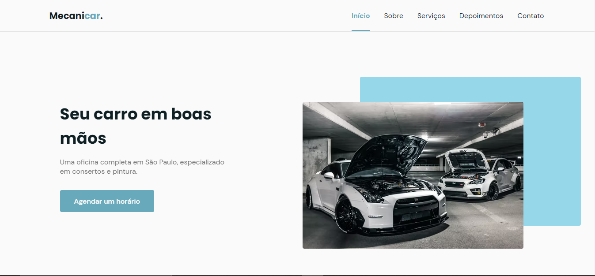
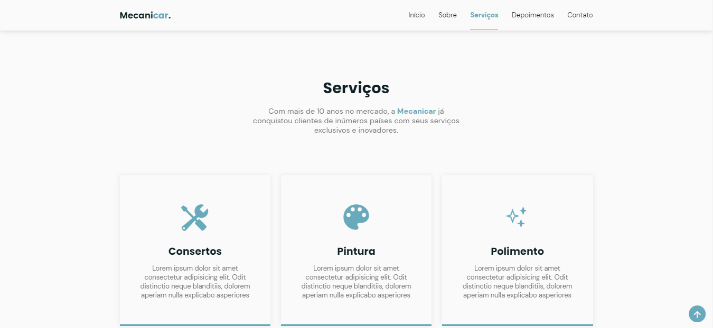
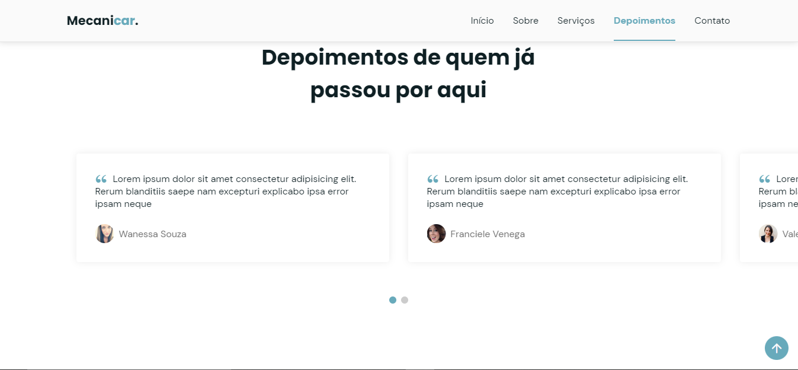
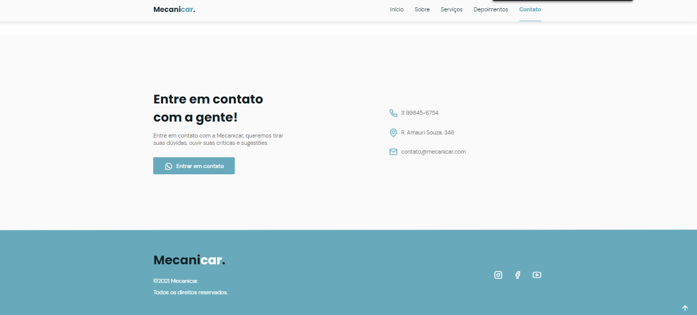

# Mecanicar

  <a href="#sobre">Sobre</a>&nbsp;&nbsp;&nbsp;|&nbsp;&nbsp;&nbsp;
  <a href="#tecnologias-utilizadas">Tecnologias utilizadas</a>&nbsp;&nbsp;&nbsp;|&nbsp;&nbsp;&nbsp;
  <a href="#como-rodar">Como rodar?</a>&nbsp;&nbsp;&nbsp;|&nbsp;&nbsp;&nbsp;
  <a href="#licença-e-autores">Licença e autor</a>

## Sobre

Desenvolvido com base no evento da Rocketseat - NLW/Together Mission: Origin, esse site tem o objetivo de promover uma empresa contando um pouco sobre a mesma, apresentando seus serviços e disponibilizando informações para contato.

Os comentários são apenas ilustrativos para praticar a desenvolvimento de um "carrossel". Também é importante observar que "Mecanicar" é uma empresa fictícia citada apenas para melhorar o entendimento do funcionamento do site.

### Algumas telas da versão de desktop

_Seção inicial:_

_Seção de serviços:_

_Seção de comentários:_

_Seção de contato:_

## Tecnologias utilizadas

Este projeto foi desenvolvido utilizando as seguintes tecnologias:

### 💻 Front-end

- [HTML](https://developer.mozilla.org/pt-BR/docs/Web/HTML)
- [CSS](https://developer.mozilla.org/pt-BR/docs/Web/CSS)
- [JavaScript](https://www.javascript.com/)

## Como rodar?

- É um site simples então basta abrir o arquivo index.html
- Também é possível vê-lo funcionando clicando [aqui](https://diegoimperiano.github.io/Mecanicar/).

## To do

Algumas ideias para melhorar a aplicação:

- Adicionar um tema dark.

Sinta-se livre para sugerir novas melhorias e correções [criando uma issue](https://github.com/DiegoImperiano/Mecanicar/issues/new) 😉.

## Licença e autor

Este projeto está sob a licença MIT. Veja o arquivo [LICENSE](https://github.com/DiegoImperiano/Mecanicar/blob/main/LICENSE) para mais detalhes.

Desenvolvido por [Diego Imperiano](https://github.com/DiegoImperiano).

